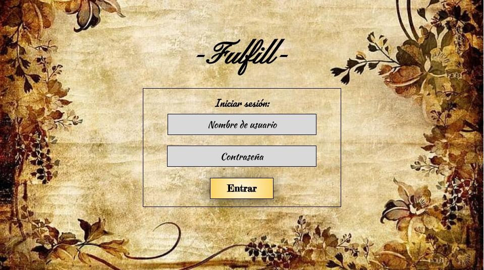

# Technical Challenge

Índice

    1. Descripción
    2. Criterios de Aceptación
    3. Requisitos Técnicos
    4. Diagrama de flujo
    5. Maquetado
    6. Aprendizajes previstos al desarrollo de la App

---

## 1. Descripción

El tiempo transcurre a una velocidad relativa a lo largo del devenir de la vida, dejandonos experiencias y aprendizajes que nutren el desarrollo intelectual y profesional de cada uno de nosotros. Al mismo tiempo, al pasar del tiempo, abrimos y cerramos ciclos que nos permiten hacer un balance de lo bueno para preservar y lo malo para aprender y mejorar.

Comenzar un nuevo ciclo implica el planteamiento de nuevas y mejores expectativas junto con el objetivo de cumplirlas y, en el mejor de los casos, aprendiendo del pasado con objetivo de mejorar técnicas y habilidades que posibiliten alcanzar las metas que cada uno se propone.

Tal es el caso del fin/comienzo del **año nuevo** en el se hace un recuento de las experiencias vividas y a su vez aparecen nuevos propósitos por alcanzar.

---

## 2. Criterios de Aceptación

El objetivo de esta aplicación es ser una herramienta tecnológica que coadyuve al logro de los propósitos y objetivos en mente en los siguientes campos:

- Temas seleccionables desplegables: personal, profesional, relaciones, familia, salud y aprendizaje

- Título: Ingrese para agregar un título corto

- Descripción: Área de texto para agregar la descripción del objetivo.

- Desplegable con el mes objetivo de consecución.

---

## 3. Requisitos técnicos

- Se siguen todos los pasos del ciclo de vida del desarrollo software (Software Development Lyfecycle) y se documentan.

- Aplicación desarrollada sólo con JavaScript Vanilla.

- Uso de Firestore de Firebase para mantener los datos.

- Uso de arquitectura modular.

---

## 4. Diagrama de Flujo

## 5. Maquetado

### Pantalla 1 (login)

### Pantalla 1.1

### Pantalla 2.1

### Pantalla 2.2

## 

## 6. Aprendizajes previstos al desarrollo de la App

- [ ] window object
- [ ] Arrow Functions and parameters
- [ ] Short, readable and reusable code
- [ ] Objects & Arrays
- [ ] JSON
- [ ] Iterators
- [ ] Firebase: Firestore DB
- [ ] Bootstrap 5
- [ ] Continuous Integration Tools: Git & GitHub

---
